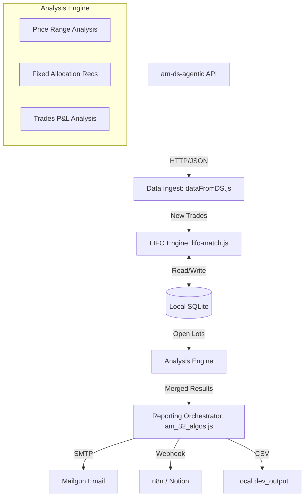

# System Diagram

## Structure Manifest
- [Overview](#overview)
- [Architecture](#architecture)
- [Data Flow](#data-flow)
- [Tech Stack](#tech-stack)
- [File Map](#file-map)
- [Next](#next)

## Overview
`am-algos-agentic` is the strategy and reporting brain of the ecosystem. It does not ingest raw data directly; instead, it consumes normalized trading data from `am-ds-agentic` to perform LIFO-based lot tracking and generate actionable trading recommendations.

## Architecture

## Data Flow
1. **Fetch**: `am_32_algos.js` triggers `dataFromDS` to retrieve current positions and trade history from the Data Service.
2. **Sync**: `lifo-dataUpdater` checks the last processed timestamp in the local SQLite DB and fetches only "new" trades from DS.
3. **Lot Matching**: `lotsLifo` processes new trades, matching sells against buys in LIFO order, calculating realized P&L, and updating the local `openPositions` table.
4. **Fidelity Check**: `positionFidelityChecker` validates that the sum of local LIFO lots matches the total position count reported by DS.
5. **Analyze**: 
    - `priceRange` calculates buy/sell bands based on current prices.
    - `fixedAllocRecs` suggests adjustments based on dollar-value targets (Floor/Ceiling).
    - `tradesPLAnalysis` calculates unrealized P&L for all active positions.
6. **Distribute**: Results are aggregated, rendered into HTML via EJS templates, and dispatched to Mailgun and Notion.

## Tech Stack
- **Runtime**: Node.js 20+ (ES Modules)
- **Database**: SQLite3 (for local persistence of lot state)
- **Templating**: EJS (for HTML email generation)
- **Communication**: Mailgun.js, Node-Fetch

## File Map
### Core logic
- `am_32_algos.js`: Main entry point and orchestration.
- `modules/dataFromDS/`: HTTP client for the Data Service.
- `modules/lifo-match/`: LIFO matching engine and database synchronization.
- `modules/priceRange/`: Price-band calculation logic.
- `modules/fixedAllocRecs/`: Allocation strategy logic (Single & Range).
- `modules/tradesPLanalysis/`: P&L and cost-basis analysis.

### Shared & Infrastructure (via modules_com submodule)
- `modules_com/db/`: Database connection and query wrappers.
- `modules_com/mailgun/`: Email dispatch service.
- `modules_com/n8nNotion/`: Webhook client for Notion updates.
- `modules_com/Scheduler/`: Weekday/Time-based execution logic.

## Next
- **Security**: Migrate to parameterized SQL queries.
- **Reliability**: Add unit tests for `lifo-match.js` logic using mock trade data.
- **Observability**: Implement structured logging to replace `console.log`.
